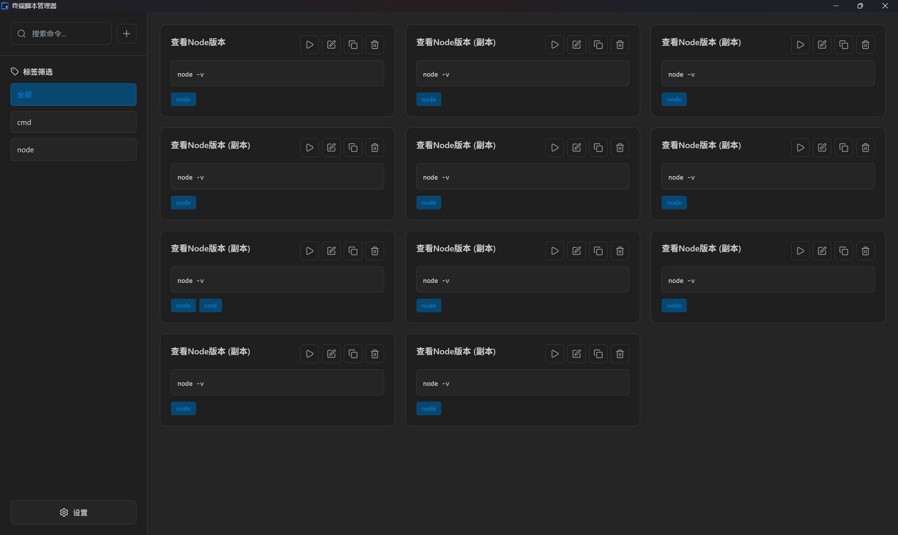

# Terminal Script Manager

一个轻量级的 Windows 终端命令管理器，帮助你高效管理和执行常用的终端命令。


## 📸 应用截图



*深色主题界面展示 - 支持命令管理、标签筛选、快速搜索等功能*

## ✨ 功能特性

- **命令管理** - 存储和组织你的常用终端命令
- **一键执行** - 点击按钮即可在系统终端中执行命令
- **终端类型选择** - 为每个命令指定使用 CMD 或 PowerShell 执行
- **终端类型筛选** - 快速筛选查看特定终端类型的命令
- **标签分类** - 使用标签对命令进行分类管理
- **快速搜索** - 通过命令名称、内容或标签快速查找
- **命令复制** - 快速复制现有命令创建新命令
- **导入导出** - 备份和迁移你的命令数据
- **深浅色主题** - 支持明暗两种主题切换，默认深色主题
- **自动更新** - 内置更新检查功能，一键升级到最新版本
- **轻量高效** - 内存占用不到 5MB

## 📚 使用指南

### 添加命令

1. 点击左侧边栏顶部的 **"+ 添加命令"** 按钮
2. 填写命令信息：
   - **命令名称**：给命令起一个容易识别的名字（必填）
   - **终端类型**：选择使用 CMD 或 PowerShell 执行此命令
   - **命令内容**：输入要执行的终端命令（必填）
   - **标签**：添加标签便于分类，多个标签用逗号分隔（可选）
3. 点击 **"保存"** 按钮

**示例：**
- 名称：`启动开发服务器`
- 终端类型：`PowerShell`
- 命令：`npm run dev`
- 标签：`开发, Node.js`

### 执行命令

1. 在命令列表中找到要执行的命令
2. 点击命令卡片右侧的 **"运行"** 按钮（播放图标）
3. 应用会自动打开系统终端并执行该命令

### 编辑命令

1. 找到要编辑的命令
2. 点击命令卡片右侧的 **"编辑"** 按钮（铅笔图标）
3. 修改信息后点击 **"保存"**

### 复制命令

1. 找到要复制的命令
2. 点击命令卡片右侧的 **"复制"** 按钮（复制图标）
3. 系统会自动创建一个名为 `原命令名 (副本)` 的新命令

### 删除命令

1. 找到要删除的命令
2. 点击命令卡片右侧的 **"删除"** 按钮（垃圾桶图标）
3. 在确认对话框中点击 **"确定"**

### 使用终端类型筛选

1. 在左侧边栏的 **"终端类型"** 区域，可以看到三个筛选选项
2. 点击 **"全部"** 显示所有命令
3. 点击 **"CMD"** 只显示使用 CMD 执行的命令
4. 点击 **"PowerShell"** 只显示使用 PowerShell 执行的命令

**提示：** 终端类型筛选可以与标签筛选和搜索同时使用，帮助你快速找到需要的命令。

### 使用标签筛选

1. 在左侧边栏的 **"标签"** 区域，可以看到所有已使用的标签
2. 点击任意标签，命令列表会只显示包含该标签的命令
3. 再次点击同一标签可取消筛选

### 搜索命令

1. 在左侧边栏顶部的搜索框中输入关键词
2. 搜索会实时匹配命令名称、命令内容和标签
3. 清空搜索框可显示所有命令

**提示：** 搜索、终端类型筛选和标签筛选可以同时使用，帮助你更精准地找到需要的命令。

### 导出命令

1. 点击左侧边栏底部的 **"设置"** 按钮（齿轮图标）
2. 在设置对话框中点击 **"导出命令"** 按钮
3. 选择保存位置和文件名
4. 命令数据会以 JSON 格式导出

**用途：** 备份数据、在不同设备间迁移命令、与团队成员共享命令集

### 导入命令

1. 点击左侧边栏底部的 **"设置"** 按钮
2. 在设置对话框中点击 **"导入命令"** 按钮
3. 选择之前导出的 JSON 文件
4. 系统会自动验证并导入命令

**注意：** 导入的命令会添加到现有命令中，不会覆盖原有数据。

### 切换主题

1. 点击左侧边栏底部的 **"设置"** 按钮
2. 在设置对话框中可以配置：
   - **主题** - 选择浅色或深色模式
   - **默认终端类型** - 设置新建命令时的默认终端类型（CMD 或 PowerShell）
3. 设置会立即生效并自动保存

**提示：** 每个命令可以单独设置终端类型，不受默认设置影响。

## ❓ 常见问题

### 命令执行失败怎么办？

**可能原因：**
- 命令语法错误
- 环境变量未配置（相关工具未添加到系统 PATH）
- 工作目录不正确

**解决方法：**
- 先在系统终端中手动测试命令是否可用
- 使用绝对路径代替相对路径
- 在命令前添加 `cd /path/to/directory &&` 切换工作目录

### 如何执行需要管理员权限的命令？

在命令前添加提权命令：
```
powershell -Command "Start-Process cmd -Verb RunAs -ArgumentList '/c your-command'"
```

### 数据存储在哪里？

命令数据存储在：
```
%APPDATA%\com.terminal-script-manager.app\commands.json
```

### 如何备份我的数据？

**方法一：使用导出功能**（推荐）
- 在应用中使用"导出命令"功能
- 将导出的 JSON 文件保存到安全位置

**方法二：直接复制数据文件**
- 复制上述路径中的 `commands.json` 文件

### 可以在多台电脑间同步命令吗？

目前不支持自动同步，但你可以：
1. 在电脑 A 上导出命令
2. 将导出的 JSON 文件传输到电脑 B
3. 在电脑 B 上导入命令

### 支持哪些类型的命令？

支持所有可以在 Windows 终端中执行的命令，包括：
- CMD 命令（如 `dir`, `cd`, `mkdir`）
- PowerShell 命令（如 `Get-Process`, `Set-ExecutionPolicy`）
- 包管理器命令（如 `npm`, `pip`, `yarn`）
- Git 命令
- 自定义脚本
- 任何已安装的命令行工具

**提示：** 你可以为每个命令选择最合适的终端类型。例如，PowerShell 命令应选择 PowerShell 类型，传统的批处理命令应选择 CMD 类型。

### 如何选择 CMD 还是 PowerShell？

**选择 CMD 的情况：**
- 传统的 Windows 批处理命令
- 需要兼容旧版 Windows 系统的命令
- 简单的文件操作命令

**选择 PowerShell 的情况：**
- 使用 PowerShell 特有的 cmdlet（如 `Get-*`, `Set-*`）
- 需要更强大的脚本功能
- 现代的开发工具命令（如 `npm`, `git`）

**不确定时：** 可以先尝试 PowerShell，如果执行失败再切换为 CMD。

---

**自动发布** 
# 双击运行或命令行执行
release.bat

# 或直接指定版本类型
release.bat patch   # 补丁版本
release.bat minor   # 次要版本  
release.bat major   # 主要版
